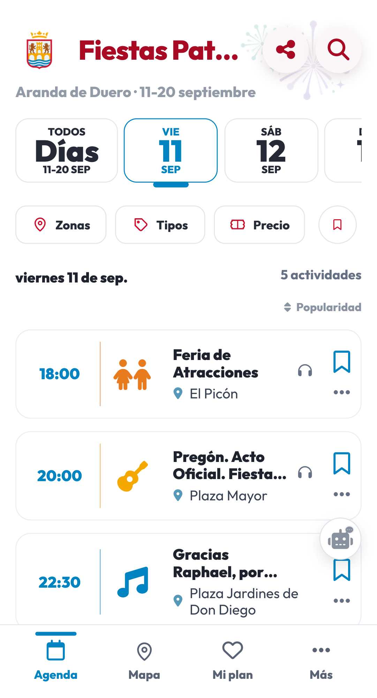
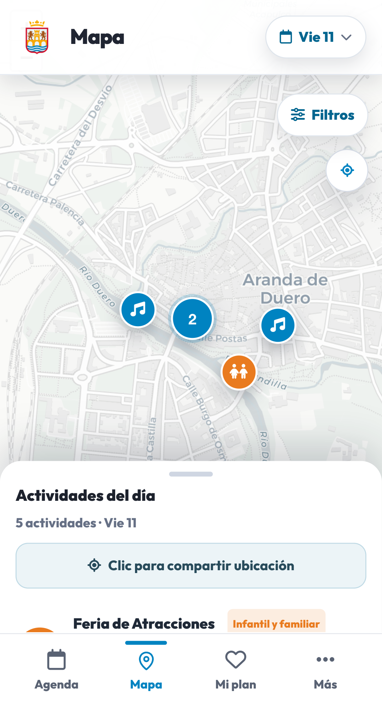
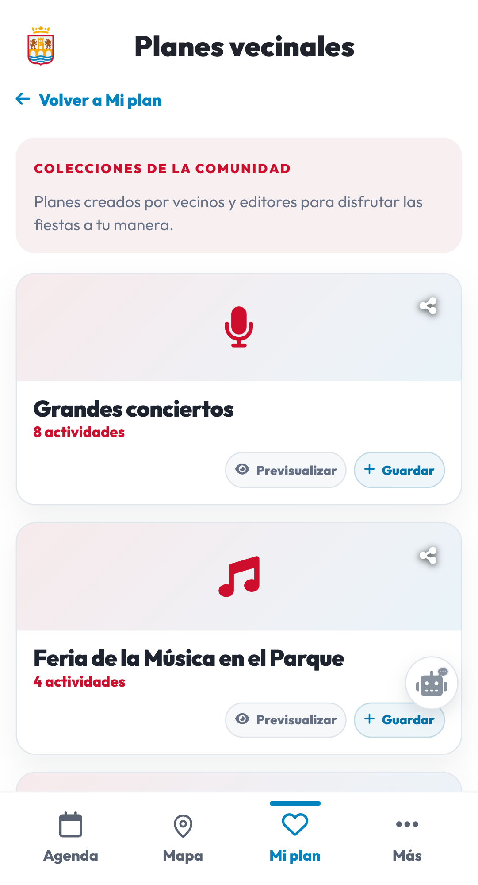

# Fiestas Patronales de Aranda de Duero 2026

Esta es la agenda web de las Fiestas Patronales de Aranda de Duero 2026 (Virgen de las Viñas), publicada en [fiestas.arandadeduero.dev](https://fiestas.arandadeduero.dev/) por [Ayuntamiento de Aranda de Duero. Concejalía de Innovación](https://www.arandadeduero.es/).

Es un fork del proyecto de código abierto [Fiestas Valladolid 2026](https://fiestas.aldeapucela.org/), creado por vecinos voluntarios de [Aldea Pucela](https://aldeapucela.org/), adaptado a la ciudad de Aranda de Duero.

La web de producción concentra el programa en una experiencia sencilla para consultar qué ocurre cada día, dónde, cómo llegar y qué actividades merece la pena guardar.

## Vista rápida en móvil

Las tres pantallas principales de la aplicación:

<table>
  <tr>
    <td align="center" valign="top"><strong>Agenda</strong> </td>
    <td align="center" valign="top"><strong>Mapa</strong> </td>
    <td align="center" valign="top"><strong>Planes vecinales</strong> </td>
  </tr>
</table>

## La aplicación

La aplicación permite:

- consultar la agenda por días y horarios;
- buscar actividades por texto;
- filtrar por tipo, zona, precio y actividades guardadas;
- cambiar entre agenda y mapa (centrado en Aranda de Duero);
- abrir una ficha completa de cada actividad;
- consultar ubicación, coordenadas, entradas, organizadores y descripción;
- abrir indicaciones y añadir actividades al calendario con un recordatorio 15 min antes;
- guardar favoritos y organizar planes personalizados;
- recibir un aviso del navegador 15 min antes de una actividad favorita (opcional, con permiso);
- exportar, compartir e importar planes;
- explorar planes públicos preparados por la comunidad;
- compartir actividades y la agenda;
- instalar la web como PWA y consultar contenido visitado sin conexión;
- cambiar entre tema claro y oscuro.

Los favoritos, planes personales y preferencias se guardan localmente en el navegador. No requieren cuenta y no se sincronizan con un servidor.

### Funciones desactivadas en este fork

Estas partes existen en el código pero están apagadas por un flag de entorno porque todavía no aplican a Aranda de Duero:

| Flag | Función |
| --- | --- |
| <code>FIESTAS_CASETAS_ENABLED=true</code> | Mapa y fichas de casetas de feria de día y «pinchos populares». |
| <code>FIESTAS_POPULAR_ENABLED=true</code> | Página <code>/populares/</code> (ranking de actividades más guardadas). Requiere un backend de contadores. |
| <code>FIESTAS_TRANSIT_ENABLED=true</code> | Paradas y líneas de autobús cercanas en las fichas (era VallaBus). |

## Web de producción

La web se publica en:

~~~text
https://fiestas.arandadeduero.dev/
~~~

Sus principales rutas son:

| Ruta | Uso |
| --- | --- |
| <code>/</code> | Agenda principal. |
| <code>/mapa/</code> | Mapa de actividades con coordenadas. |
| <code>/e/&lt;id&gt;/&lt;slug&gt;/</code> | Ficha permanente de una actividad. |
| <code>/plan/</code> | Favoritos y planes personales del navegador. |
| <code>/plan/importar/</code> | Importación de planes compartidos. |
| <code>/planes/</code> | Planes públicos de la comunidad. |
| <code>/planes/&lt;id&gt;/</code> | Ficha de un plan público. |
| <code>/colaboradores/</code> | Entidades y proyectos que difunden la web. |
| <code>/sitemap.xml</code>, <code>/robots.txt</code> | Generados en cada build a partir de las páginas indexables reales. |

La producción es una web estática: el contenido se genera en <code>dist/</code> y se publica mediante GitHub Pages. El workflow de [deploy-pages.yml](.github/workflows/deploy-pages.yml) construye el sitio en cada push a <code>main</code>, <code>master</code> o <code>aranda</code>.

## Servicios externos

- **Google Fonts** (`fonts.googleapis.com`): tipografía Outfit.
- **Google Analytics 4** (`www.googletagmanager.com`): solo se carga tras aceptar el aviso de consentimiento. Ver [docs/analytics.md](docs/analytics.md).
- **Leaflet + CARTO** (`unpkg.com`, `basemaps.cartocdn.com`): mapa, cargado bajo demanda al abrirlo.
- **api.arandadeduero.es**: contadores de guardados y previsión meteorológica. Aún no existe; la web funciona sin ellos.

Font Awesome se sirve como subconjunto self-hosted (`npm run icons`), sin CDN externo.

## Estructura técnica

El proyecto separa los datos, la generación de páginas y el comportamiento del navegador:

| Parte | Responsabilidad |
| --- | --- |
| <code>src/data/</code> | Programa de actividades y catálogo de planes públicos. |
| <code>src/templates/</code> | Plantillas Nunjucks para agenda, mapa, fichas y planes. |
| <code>src/styles/</code> | CSS de la aplicación, procesado con Tailwind, PostCSS y Autoprefixer. |
| <code>src/scripts/</code> | Módulos ES del navegador: agenda, filtros, mapa, favoritos, planes, recordatorios, PWA, tema y analítica (Google Analytics con consentimiento). |
| <code>src/assets/</code> | Imágenes, iconos, manifest y recursos editoriales. |
| <code>src/pwa/</code> | Service worker y página offline. |
| <code>scripts/build.mjs</code> | Generador estático que valida datos y escribe <code>dist/</code>. |
| <code>scripts/dev.mjs</code> | Servidor local con build inicial y reconstrucción al cambiar <code>src/</code>. |
| <code>tests/</code> | Pruebas automatizadas del código JavaScript. |

El navegador recibe HTML ya generado y módulos JavaScript que añaden la interacción. El mapa carga Leaflet bajo demanda. Los recursos propios de CSS y JavaScript se publican con versiones derivadas de su contenido para evitar problemas de caché.

## Programa de actividades

El programa vive en <code>src/data/fiestas-2026/events.json</code> y se edita a mano. Cada actividad tiene un ID numérico estable; el build genera slug, URL, metadatos sociales y, cuando hay coordenadas, los enlaces de mapa. Los planes públicos se definen en <code>src/data/community-plans.json</code> y sus archivos viven en <code>src/data/community-plans/</code>.

Para revisar y completar coordenadas se usa Nominatim (OpenStreetMap):

~~~bash
npm run locations:audit                                  # informe, sin tocar datos
node scripts/enrich-event-locations.mjs --provider=nominatim --apply
~~~

El informe queda en <code>.cache/fiestas/reports/</code>. Respeta el límite de 1 petición/segundo de Nominatim y solo aplica coincidencias con una confianza suficiente; el resto se anota para revisión manual.

> El script de importación desde un sitio de eventos externo (<code>scripts/import-eventos-ferias.mjs</code>, <code>npm run events:import:ferias</code>) se hereda del proyecto original y **no está operativo en este fork**: no existe un sitio de eventos de Aranda de Duero del que importar.

## Recordatorios de favoritos

Cuando guardas una actividad, la app ofrece dos vías para avisarte 15 minutos antes:

- **Calendario**: los ficheros <code>.ics</code> que exporta cada actividad y cada plan incluyen un <code>VALARM</code> con <code>TRIGGER:-PT15M</code>. Es la vía fiable en móvil. El recordatorio se puede personalizar o quitar (<code>createIcs(..., { reminderMinutes })</code>).
- **Aviso del navegador** (opcional): desde el menú lateral se activa «Avisarme 15 min antes de mis favoritos». Usa la Notification API y programa <code>setTimeout</code> mientras la pestaña está abierta; el service worker muestra la notificación. Requiere permiso del usuario y solo cubre las próximas ~26 h.

No hay servidor de push: si el navegador está cerrado, el aviso lo da el calendario.

## Analítica

Google Analytics 4 (<code>G-BXMC22W46S</code>) con consentimiento explícito: el script **no se carga ni envía nada** hasta que se pulsa «Aceptar» en el banner inferior, y «Denegar» se recuerda. Detalles y taxonomía de eventos en [docs/analytics.md](docs/analytics.md).

## Desarrollo local

La instalación, el servidor local, las pruebas, el build, la auditoría de ubicaciones y las opciones de configuración están documentados en:

[Guía de desarrollo local](docs/local-development.md)

## Licencia

El código fuente se publica bajo [GNU AGPL versión 3.0](https://www.gnu.org/licenses/agpl-3.0.html); consulta el archivo [LICENSE](LICENSE).

El contenido se publica bajo [CC BY-SA 4.0](https://creativecommons.org/licenses/by-sa/4.0/deed.es); consulta [LICENSE-CONTENT](LICENSE-CONTENT).

El código está disponible en [GitHub](https://github.com/arandadeduero/fiestas).
